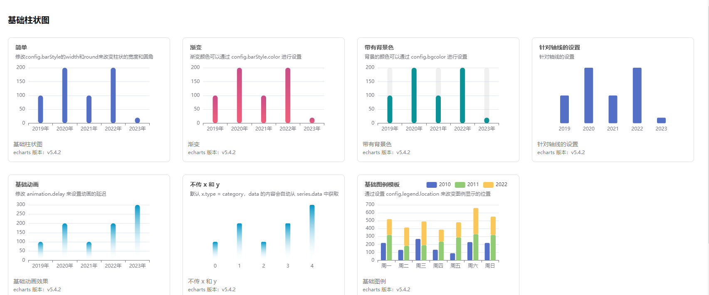
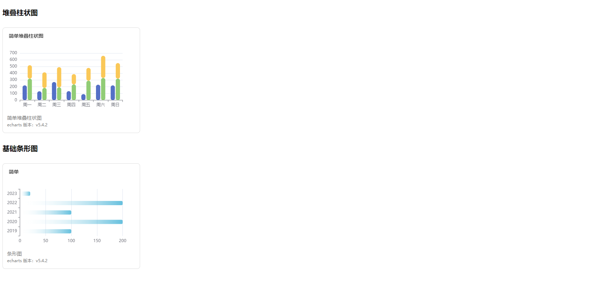

# jane-charts

一个使用 vue3 + ts + vite + echarts 编写的 echarts 示例库，暂时只包含展示功能，后续会进行完善图例编辑功能和预览功能。

## 项目进度
- 2023/6/25：
  1. `优化展示页面的 ui`
  2. `新增了折线图示例，并且对柱状图的配置进一步的优化和完善`
  3. `新增了兼容功能，若是没有传递 x 也没有 y 的话，默认 x.type = category，data 的内容会自动从 series.data 中获取`
  4. `bug 修复: 当没有传递 x 和 y 时，设置轴线样式不生效的问题`
- 2023/6/26：
  1. `bug 修复: 首次打开项目，没有显示图表，而是要点击了之后，才会出现相对应的图表，并且标题也不对`
  2. `代码优化: 优化了处理 title 和 axis 的函数，把 axis 中的部分操作进行统一化处理`
  3. `新增了基础图例功能`

## 项目图片
> 所有的图例，都是有组件生成的，不是图片。


## 预览

- 克隆本项目
  ```
    git clone git@github.com:xuan-zai/jane-charts.git
  ```
  
- 运行本项目
  ```
    npm run dev
  ```